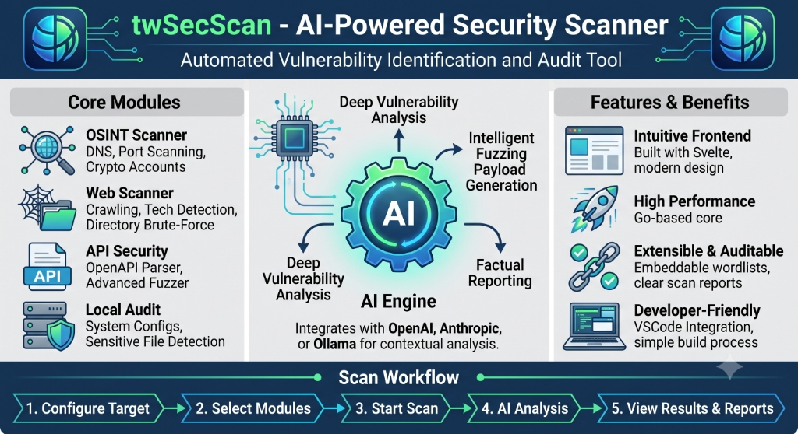
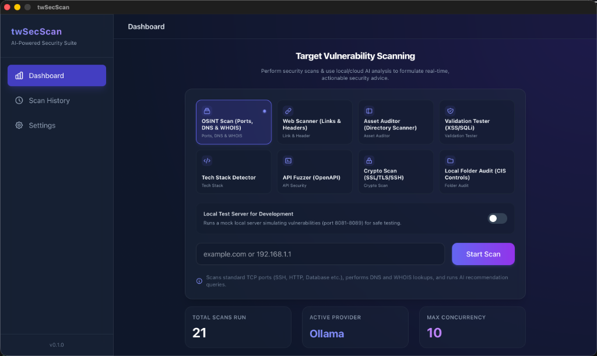
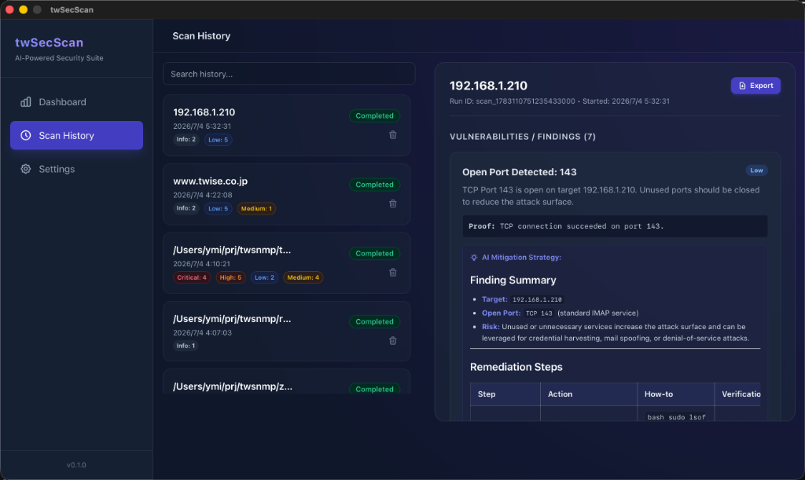
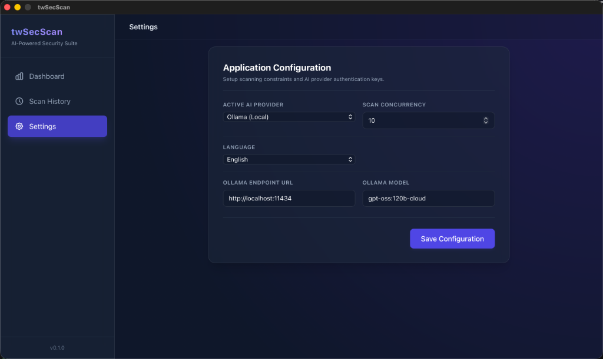

# twSecScan

**twSecScan** is an AI-powered, zero-dependency security scanner desktop application. Built with [Wails](https://wails.io/) and [Svelte 5](https://svelte.dev/), it delivers a full security suite as a single cross-platform binary — no external tools like `nmap` or `nuclei` required.

> 🇯🇵 [日本語版 README はこちら](README_ja.md)

---

## ✨ Key Features

- **9 Scan Modules** covering network, web, API, cryptographic, and local filesystem security
- **AI-powered mitigation advice** via Ollama (local), OpenAI, or Anthropic
- **Zero external dependencies** — all scanners implemented in pure Go
- **Single binary** — portable deployment, no installation required
- **Bilingual UI** — English and Japanese, with automatic OS language detection
- **Report export** — HTML, Markdown, and JSON formats
- **Scan History** — persistent storage via bbolt embedded database

---

## 🗺️ Overview



*twSecScan provides four Core Modules (OSINT, Web, API Security, Local Audit), an AI Engine that integrates with OpenAI, Anthropic, or Ollama, and a five-step Scan Workflow — all delivered as a single binary.*

---

## 🖥️ Screenshots

### Dashboard


*Enter a target URL or IP, select a scan module, and click Start Scan.*

### Findings & AI Advice


*Scan results are displayed with severity badges (Critical / High / Medium / Low / Info) and AI-generated mitigation strategies.*

### Settings


*Configure your AI provider (Ollama, OpenAI, Anthropic), scan concurrency, and UI language.*

---

## 🔍 Scan Modules

| Module | Description | Target |
|--------|-------------|--------|
| **OSINT Scan** | TCP port scan on common ports + DNS & WHOIS lookup | IP or domain |
| **Web Scanner** | Recursive crawler for broken links, HTTP security headers, PII exposure | `https://...` |
| **Asset Auditor** | Probes for exposed config files, backups, `.git`, admin panels | `https://...` |
| **Validation Tester** | Crawls pages and tests URL parameters for XSS & SQL Injection | `https://...` |
| **Tech Detector** | Identifies web server, CMS, frameworks from headers and HTML | `https://...` |
| **API Fuzzer** | Parses OpenAPI 3.0 spec and runs dynamic security fuzzing on all endpoints | URL or local file |
| **DNS & WHOIS** | Standalone DNS record + WHOIS registrar information lookup | Domain |
| **Crypto Scanner** | Checks SSL/TLS certificates, SSH banners, and mail server encryption (SMTP/IMAP/POP3) | IP or domain |
| **Local Folder Audit** | Walks a local directory checking for secrets, insecure permissions, and CIS Controls compliance | Local path |

---

## 🤖 AI Integration

twSecScan integrates with LLM providers to generate actionable mitigation advice for every finding.

| Provider | Configuration |
|----------|--------------|
| **Ollama** (default) | Runs locally. Set the endpoint URL (default: `http://localhost:11434`) and model name |
| **OpenAI** | Provide your API key in Settings |
| **Anthropic** | Provide your API key in Settings |

If no AI provider is configured, findings are still recorded with full technical details.

---

## 🛠️ Tech Stack

| Component | Technology |
|-----------|-----------|
| Backend | Go (pure Go, no CGO) |
| Frontend | Wails v2 + Svelte 5 (Runes) + Tailwind CSS |
| Database | bbolt (embedded key-value store) |
| OpenAPI Parser | `getkin/kin-openapi` |
| Build Toolchain | `mise` (Go + Node.js + Wails version management) |

---

## 🚀 Getting Started

### Prerequisites

- [mise](https://mise.jdx.dev/) — development toolchain manager

### Install Toolchain

```bash
# Install Go, Node.js, and Wails via mise
mise install
```

### Development

```bash
# Start in development mode (hot reload)
wails dev
```

### Build

```bash
# Build a production binary
wails build
```

The output binary (`twSecScan`) is placed in the `build/bin/` directory.

---

## 📁 Project Structure

```
twSecScan/
├── main.go                    # Wails entry point
├── app.go                     # Backend bindings (Frontend ↔ Backend)
├── core/
│   ├── db/bbolt.go            # Persistent storage (bbolt)
│   └── models/models.go       # Config, Scan, Finding structs
├── modules/
│   ├── ai/                    # LLM client abstraction (Ollama/OpenAI/Anthropic)
│   ├── apisec/                # OpenAPI parser + API fuzzer
│   ├── osint/                 # Port scanner, DNS/WHOIS, Crypto scanner
│   ├── webscanner/            # Crawler, Asset auditor, Validation tester, Tech detector
│   └── localaudit/            # Local folder CIS audit
├── embed/
│   └── wordlists/             # Embedded wordlists (directories, subdomains)
└── frontend/src/
    └── App.svelte             # Single-file Svelte 5 UI
```

---

## 📊 Report Export

After a scan completes, click the **Export** button in the Scan History view to save the report:

- **HTML** — Styled, self-contained report with severity badges
- **Markdown** — Plain text report suitable for documentation
- **JSON** — Raw `{scan, findings}` data for programmatic use

---

## ⚠️ Legal Notice

twSecScan is intended for **authorized security testing only**. Always obtain explicit permission before scanning any system or network you do not own. Unauthorized scanning may violate laws and regulations.

---

## 📄 License

[Apache License 2.0](LICENSE)
