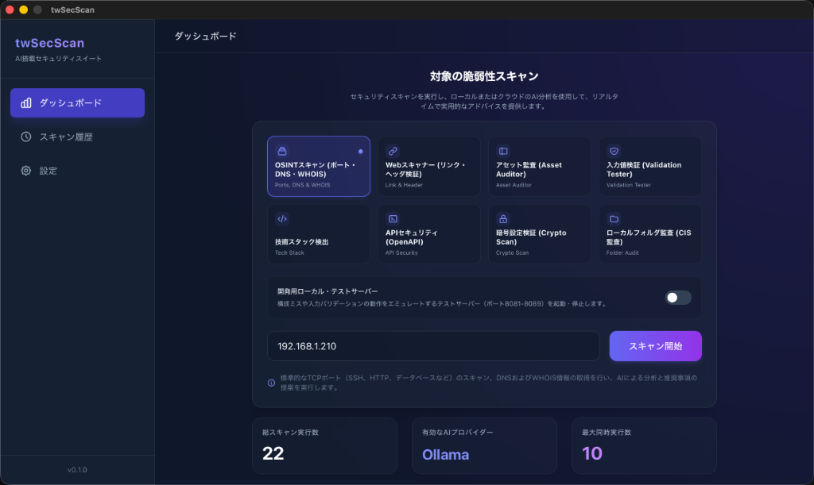
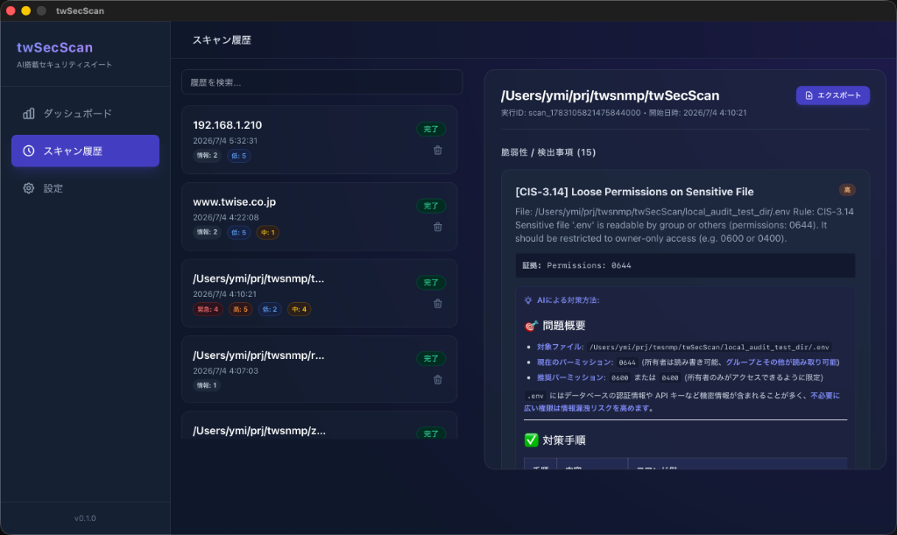
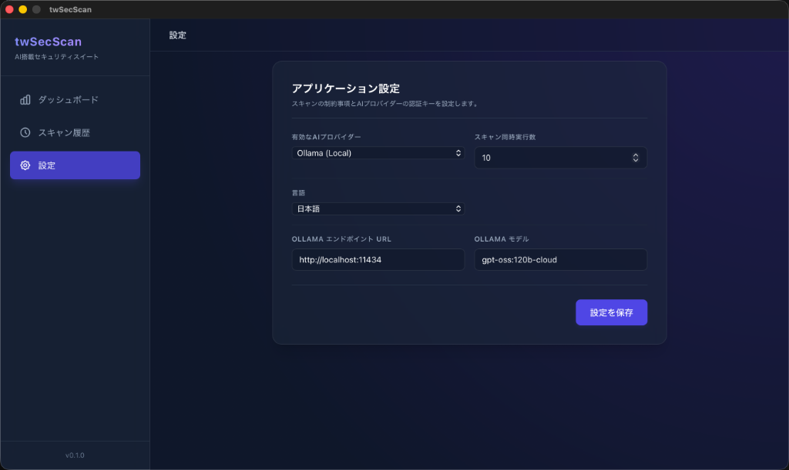

# twSecScan

**twSecScan** は、AIによる分析機能を搭載したゼロ依存のセキュリティスキャナー デスクトップアプリケーションです。[Wails](https://wails.io/) と [Svelte 5](https://svelte.dev/) を使って構築されており、`nmap` や `nuclei` などの外部ツールを一切必要とせず、クロスプラットフォーム対応の **単一実行ファイル** としてフルセキュリティスイートを提供します。

> 🇬🇧 [English README](README.md)

---

## ✨ 主な特徴

- **9種類のスキャンモジュール** — ネットワーク・Web・API・暗号設定・ローカルファイルシステムを網羅
- **AIによる対策アドバイス** — Ollama（ローカル）、OpenAI、Anthropic に対応
- **外部依存ゼロ** — すべてのスキャナーはピュアGoで実装
- **シングルバイナリ** — インストール不要のポータブル配布
- **二言語UI対応** — 日本語と英語、OSの言語設定を自動検出
- **レポートエクスポート** — HTML・Markdown・JSON形式に対応
- **スキャン履歴** — bbolt組み込みデータベースによる永続化

---

## 🖥️ スクリーンショット

### ダッシュボード


*対象URLまたはIPを入力し、スキャンモジュールを選択して「スキャン開始」をクリックするだけ。*

### 検出結果とAIアドバイス


*スキャン結果は危険度バッジ（緊急 / 高 / 中 / 低 / 情報）とAIが生成した対策方法とともに表示されます。*

### 設定画面


*AIプロバイダー（Ollama・OpenAI・Anthropic）、スキャン同時実行数、UI言語を設定できます。*

---

## 🔍 スキャンモジュール一覧

| モジュール | 説明 | スキャン対象 |
|-----------|-----|------------|
| **OSINTスキャン** | 主要TCPポートスキャン + DNS・WHOIS情報取得 | IPアドレス・ドメイン |
| **Webスキャナー** | リンク切れ・HTTPセキュリティヘッダ・個人情報露出の検出クローラー | `https://...` |
| **アセット監査** | 設定ファイル・バックアップ・`.git`・管理画面の露出チェック | `https://...` |
| **入力値検証テスター** | URLパラメータへのXSS・SQLインジェクションのテスト | `https://...` |
| **技術スタック検出** | ヘッダ・HTMLからWebサーバー・CMS・フレームワークを識別 | `https://...` |
| **APIファザー** | OpenAPI 3.0仕様書を解析し、全エンドポイントを動的にファジング | URLまたはローカルファイル |
| **DNS & WHOIS** | DNSレコード・WHOISレジストラ情報の単独取得 | ドメイン |
| **暗号設定検証** | SSL/TLS証明書・SSHバナー・メールサーバー暗号化（SMTP/IMAP/POP3）を検査 | IPアドレス・ドメイン |
| **ローカルフォルダ監査** | ローカルディレクトリを走査してシークレット露出・危険なパーミッション・CIS Controls準拠を確認 | ローカルパス |

---

## 🤖 AI連携

twSecScan はLLMプロバイダーと連携し、すべての検出事項に対して実践的な対策アドバイスを自動生成します。

| プロバイダー | 設定方法 |
|------------|---------|
| **Ollama**（デフォルト） | ローカルで動作。エンドポイントURL（デフォルト: `http://localhost:11434`）とモデル名を設定 |
| **OpenAI** | 設定画面でAPIキーを入力 |
| **Anthropic** | 設定画面でAPIキーを入力 |

AIプロバイダーが未設定の場合でも、全ての技術的な検出情報は記録されます。

---

## 🛠️ 技術スタック

| コンポーネント | 採用技術 |
|-------------|---------|
| バックエンド | Go（ピュアGo、CGO不要） |
| フロントエンド | Wails v2 + Svelte 5 (Runes) + Tailwind CSS |
| データベース | bbolt（組み込みキーバリューストア） |
| OpenAPIパーサー | `getkin/kin-openapi` |
| ビルドツールチェーン | `mise`（Go + Node.js + Wails バージョン管理） |

---

## 🚀 はじめかた

### 前提条件

- [mise](https://mise.jdx.dev/) — 開発ツールチェーン管理ツール

### ツールチェーンのインストール

```bash
# Go、Node.js、Wailsをmiseでインストール
mise install
```

### 開発モードで起動

```bash
# ホットリロードつきの開発モードで起動
wails dev
```

### ビルド

```bash
# 本番用バイナリをビルド
wails build
```

出力バイナリ（`twSecScan`）は `build/bin/` ディレクトリに生成されます。

---

## 📁 プロジェクト構成

```
twSecScan/
├── main.go                    # Wails エントリポイント
├── app.go                     # バックエンドバインディング（フロント ↔ バック）
├── core/
│   ├── db/bbolt.go            # 永続化ストレージ（bbolt）
│   └── models/models.go       # Config・Scan・Finding 構造体
├── modules/
│   ├── ai/                    # LLMクライアント抽象化（Ollama/OpenAI/Anthropic）
│   ├── apisec/                # OpenAPIパーサー + APIファザー
│   ├── osint/                 # ポートスキャン・DNS/WHOIS・暗号設定検証
│   ├── webscanner/            # クローラー・アセット監査・入力値検証・技術検出
│   └── localaudit/            # ローカルフォルダ CIS監査
├── embed/
│   └── wordlists/             # 埋め込みワードリスト（ディレクトリ・サブドメイン）
└── frontend/src/
    └── App.svelte             # 単一ファイル Svelte 5 UI
```

---

## 📊 レポートエクスポート

スキャン完了後、「スキャン履歴」ビューの **エクスポート** ボタンをクリックしてレポートを保存できます:

- **HTML** — 危険度バッジ付きのスタイル適用済みレポート（自己完結型）
- **Markdown** — ドキュメントに使いやすいプレーンテキストレポート
- **JSON** — プログラムからの利用向け `{scan, findings}` 生データ

---

## ⚠️ 免責事項

twSecScan は **許可を得た上でのセキュリティテスト** のみを目的としています。自分が所有・管理していないシステムやネットワークをスキャンする場合は、必ず事前に明示的な許可を取得してください。無許可のスキャンは法律や規制に違反する場合があります。

---

## 📄 ライセンス

[Apache License 2.0](LICENSE)
